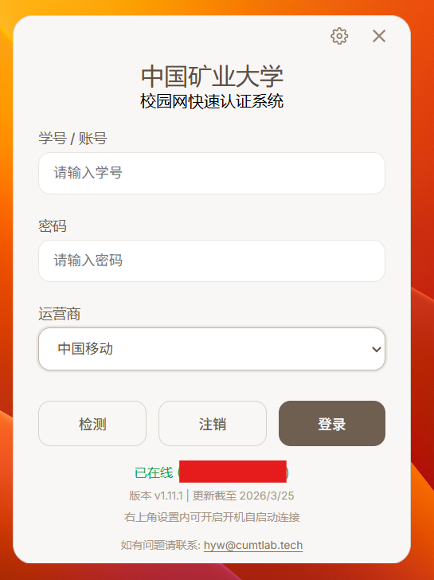
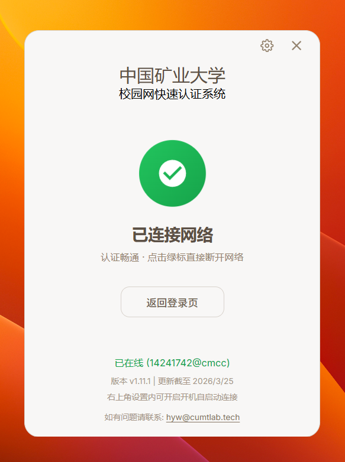
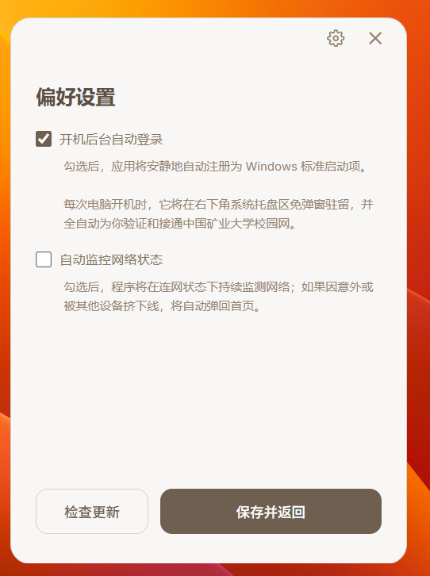

# 中国矿业大学校园网自动登录


这是一个专为中国矿业大学（CUMT）校园网设计的极轻量级、原生化自动登录客户端。

体积小巧，打包后的独立安装程序仅 **5MB** 左右，后台常驻内存极低，是替代浏览器频繁手动登录的完美方案。

## ✨ 核心特性

- ⚡️ **极简无感**：支持 Windows 注册表开机自启。
- 🛡️ **联网状态检测**：支持自定义频率（最低 5 秒）的后台断线监控轮询，遭遇网络波动或路由器被室友顶号挤下线时，自动弹出提示警告
- 📉 **超低占用**：得益于 Rust 的内存安全机制与原生系统级 API 调用，后台常驻托盘模式下对 CPU 完全零打扰。
- 🔀 **智能“顶号”逻辑**：支持内网路由器环境登录，能穿透识别当前路由器下的 Dr.com 在线 UID；当识别到非本机预设账号在线时，允许一键强行覆写接通（多设备宿舍福音）。
- **支持更新**：可一键检测最新版本，保证认证效果。

## 📸 界面预览





## 🚀 快速上手 (开发者环境)

本项目依赖完整的 [Rust 工具链](https://rustup.rs/) 和 [Node.js](https://nodejs.org/)。

### 环境准备

1. 安装 Node.js (推荐 v18+)
2. 安装 Rust (使用 `rustup` 安装)
3. 确保安装了 C++ 生成工具 (Visual Studio Desktop Development with C++)

### 安装与运行

克隆项目并进入 `rust_rebuild` 目录：

```bash
cd rust_rebuild

# 安装前端依赖
npm install

# 在开发模式下运行 (支持热重载)
npm run tauri dev
```

### 📦 构建生产版本

如需编译并打包出 `.exe` 或 `.msi` 安装包，请执行：

```bash
npm run tauri build
```

编译成功后，完整的 NSIS 安装包将会输出到：
`src-tauri/target/release/bundle/nsis/`

## ⚙️ 架构与技术栈

* **后端逻辑 (Rust)**：使用 `reqwest` 拦截并代理 Dr.com 的 `chkstatus` 与认证协议发包；通过原生 `winreg` 库覆写 HKCU 注册表实现自启；通过 Tauri 系统托盘 (SystemTray) 与 Notification API 实现后台驻留与断网提示。
* **前端渲染 (Webview2)**：抛弃所有庞大框架，使用 `Vanilla Javascript` + 纯 `HTML/CSS` 手写构建，保证页面秒级渲染响应。
* **数据持久化**：所有的本地用户凭证与配置储存在本地，可持久化存储。

## 📜 协议声明

本项目仅供学习与交流 Tauri 及 Rust 技术栈使用，请自觉遵守中国矿业大学校园网相关使用规定，切勿用于恶意并发请求等破坏性行为。

基于 **MIT License** 开源。
